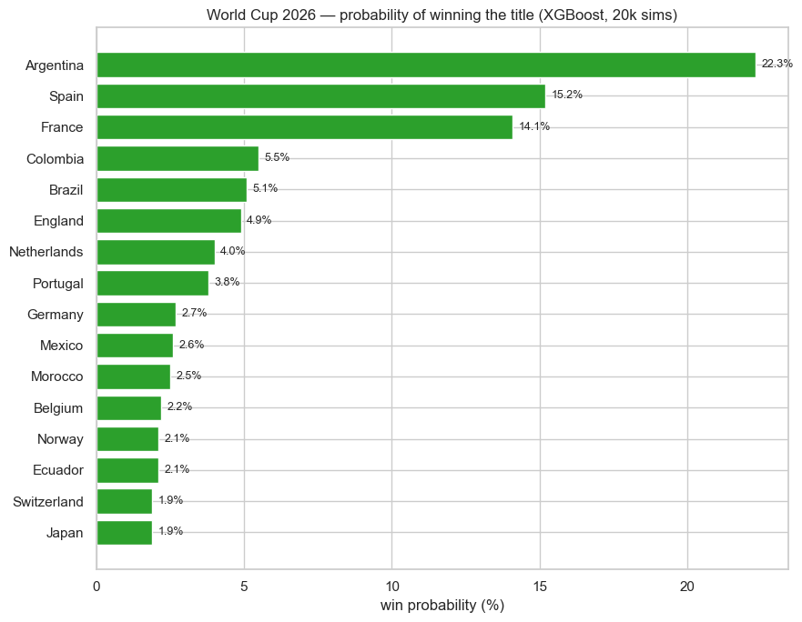
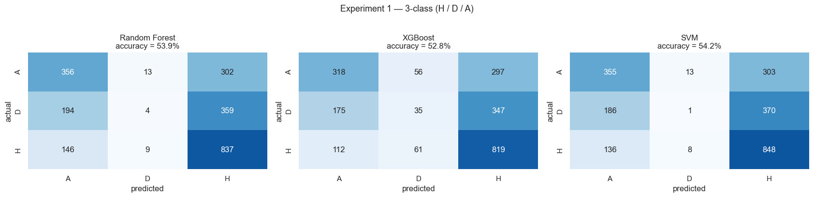
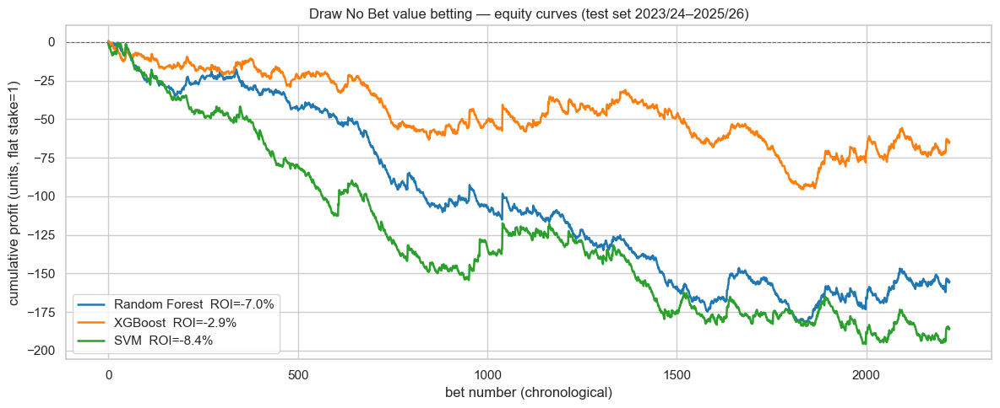
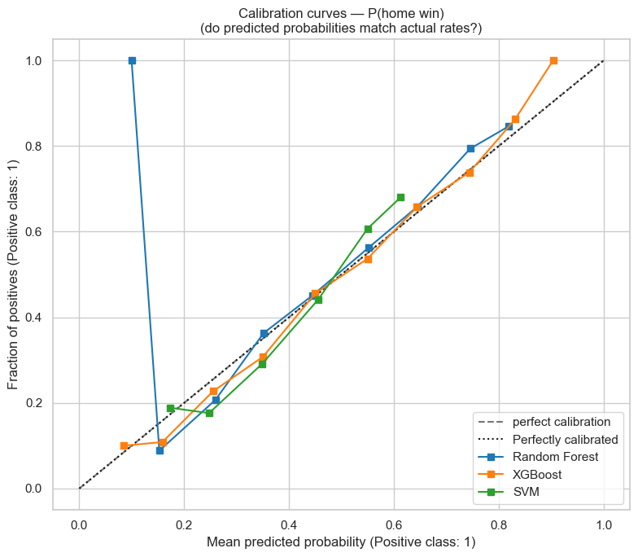
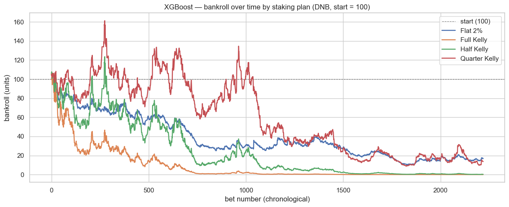
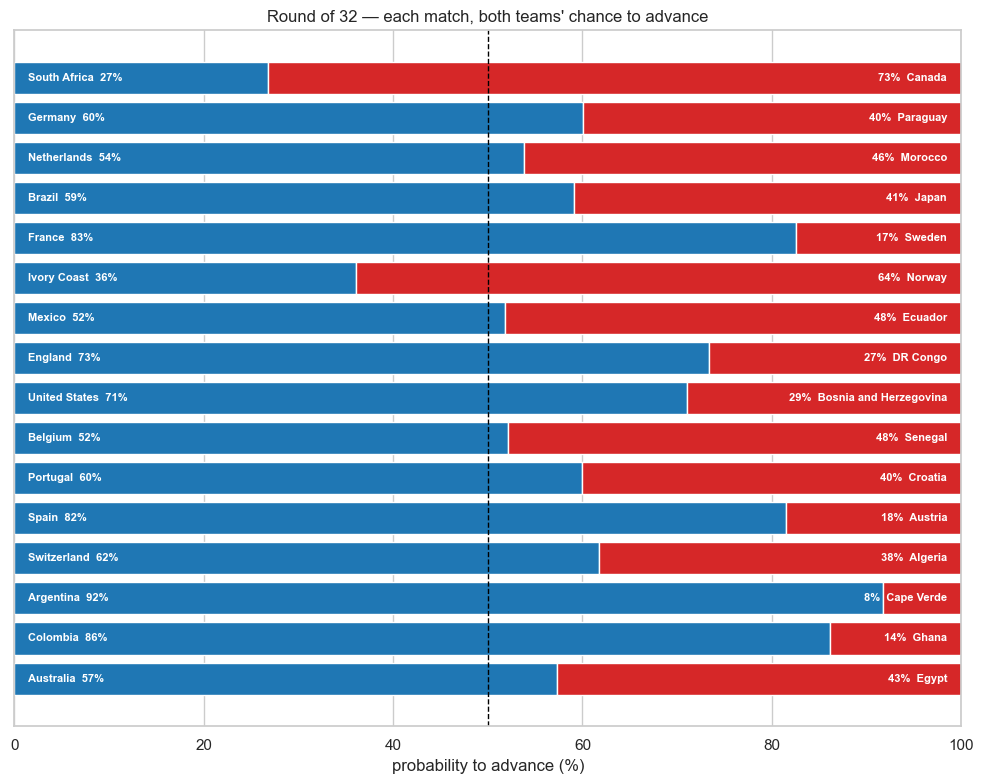
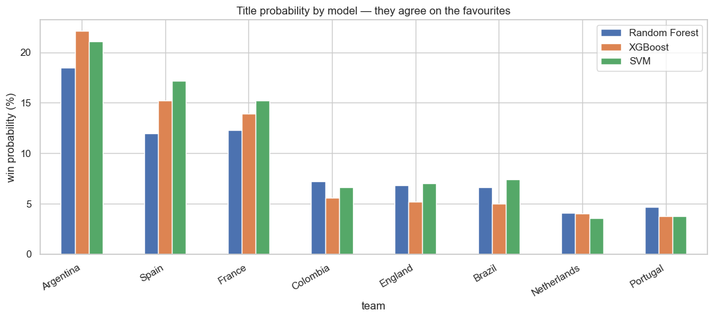

# Football Match Prediction with Machine Learning

> Can machine learning beat the betting market? And who will win the 2026 World Cup?


This project builds and compares three classifiers (Random Forest, XGBoost, SVM) and applies the same methodology to two real decisions:

- **Application A: league betting.** Predict Premier League and La Liga matches, then simulate value betting against real bookmaker odds. The models reach the bookmaker's accuracy ceiling (about 54%) but never beat the closing line, and every betting strategy loses money. In other words, an empirical demonstration of market efficiency.
- **Application B: World Cup 2026.** Rate every national team with an Elo rating computed from scratch on 49,493 international matches (1872 to 2026), train the same three models on the modern era, validate them on the real 2026 group stage (25 of 32 advancing teams predicted correctly), and run 20,000 Monte Carlo simulations of the knockout bracket.

<p align="center">
  
</p>

## Headline results

| Question | Answer |
|---|---|
| Best 3-class test accuracy (H/D/A) | 54.2% (SVM), vs 54.7% for the bookmaker favorite |
| Best betting ROI on 2,220 test matches | **-2.9%** (XGBoost, Draw No Bet). Every model loses to the margin |
| Closing Line Value vs Pinnacle | Negative for all models: no edge over the sharpest market |
| 2026 group stage validation | 25 of 32 qualified teams predicted correctly, about 60% match accuracy |
| World Cup 2026 favorite | Argentina 22.3%, then Spain 15.2% and France 14.1%, stable across all three models |

The betting result is deliberately presented as it is: **no model beats the market**. Closing odds already price all public information, so a model built on public data can match the bookmaker's accuracy but cannot out-predict it. Getting a clean negative result required getting everything else right (no leakage, honest splits, de-vigged odds), which is the real point of the project.

> **Sequel:** [value-betting-scanner](https://github.com/zakariae-boui/value-betting-scanner) takes this conclusion seriously and inverts the approach. If the sharp closing line cannot be out-predicted, use it as the truth and scan recreational bookmakers for prices that disagree with it. No prediction at all, and it worked: +4.0% average closing line value over 224 paper bets, the edge this project showed prediction alone cannot produce.

## Application A: can we beat the bookmaker?

**Data.** 6,080 matches, Premier League + La Liga, 8 seasons (2018/19 to 2025/26), built from two sources merged on (date, home team, away team):

- [football-data.co.uk](https://www.football-data.co.uk/data.php): results, match stats, and odds from Bet365 and Pinnacle (opening and closing)
- [Understat](https://understat.com): expected goals (xG) per team per match

**Features.** 62 engineered, leakage-safe features in four families: recent form over the last 5 matches (points, goals, shots on target, venue-specific form), xG form, market signal (de-vigged implied probabilities and bookmaker margin), and context (rest days, head-to-head). Difference features (home minus away) carry most of the signal.

**Leakage control.** Every feature is computed only from matches that finished before the current one (chronological `shift(1)`, windows reset per season), and 41 post-match columns are explicitly banned from the model. The validation in notebook `02` includes a useful sanity check: the honest form feature `diff_form_xgd` correlates 0.288 with the result, while the in-match xG (which a real predictor could never know) correlates 0.507. When a feature looks too good, it is usually leaking.

**Methodology.** Sports results are a time series, so the split is chronological, never random: train on 2018/19 to 2021/22, tune hyperparameters on 2022/23, and keep 2023/24 to 2025/26 as an untouched test set. Tuned settings are deliberately conservative (shallow trees, slow learning rate) because football is noisy.

| Model | 3-class accuracy | Draw recall | ROI (Draw No Bet) | Avg CLV |
|---|---|---|---|---|
| Random Forest | 53.9% | 0.7% | -7.0% | -0.004 |
| XGBoost | 52.8% | 6.3% | **-2.9%** | -0.001 |
| SVM | 54.2% | 0.2% | -8.4% | -0.014 |
| Bookmaker favorite | **54.7%** | | | |

<p align="center">
  
</p>

The confusion matrices show the real difficulty: the draw. It is rare (about 25% of matches) and has no distinctive statistical profile, so recall on draws collapses toward zero for every model. This is why the project reports F1 and per-class recall, not accuracy alone.

**Betting simulation.** For every test match, the model's probability is compared with the bookmaker's de-vigged implied probability; when the model sees more value than the market, a bet is placed at Bet365 odds and later benchmarked against Pinnacle's closing line (CLV). Flat-stake equity curves over 2,220 matches:

<p align="center">
  
</p>

**Probability quality.** The probabilities themselves are well calibrated (XGBoost especially), which matters more than accuracy for betting. Calibration is exactly why the simulation is a fair test and not an artifact of overconfident predictions:

<p align="center">
  
</p>

**Staking.** Given no real edge, the Kelly criterion cannot save you; it only decides how fast you lose. Full Kelly busts the bankroll fastest, quarter Kelly survives longest:

<p align="center">
  
</p>

## Application B: forecasting the 2026 World Cup

The FIFA ranking in public datasets stops in 2024, so team strength is computed from scratch: a **World Football Elo** engine (K factor by competition importance, goal-difference multiplier, home advantage) walks all 49,493 international matches from 1872 to 2026 in date order. Pre-match ratings are stored before each update, so the rating a match sees never includes its own result. With zero manual tuning, the resulting top of the table is Argentina, Spain, France: a good sign the engine works.

The same three models are trained on the modern era (2002 onward, 17,588 matches) with Elo difference, Elo levels, recent form, and a neutral-venue flag as features. Validation uses everything from 2021 to June 2026 (including the 2022 World Cup), and the final test is the actual 2026 group stage, which had already been played: **the models correctly identify 25 of the 32 teams that advanced**, with the misses concentrated among the third-placed bubble teams, the genuinely hardest calls.

For the knockout phase, a group table can use expected points, but a bracket needs a winner for every tie. So the bracket is simulated 20,000 times: each match is decided by a weighted coin flip using the model's win probability (draws resolved 50/50, like a shootout), and the winner advances until the final.

The Round of 32 ties are already drawn, so the first knockout round can be shown head-to-head, each team's probability of advancing in its actual matchup:

<p align="center">
  
</p>

| Team | Reach final | Win the cup |
|---|---|---|
| Argentina | 35.3% | **22.3%** |
| Spain | 25.9% | 15.2% |
| France | 24.5% | 14.1% |
| Colombia | 11.8% | 5.5% |
| Brazil | 10.2% | 5.1% |

The forecast is robust: Random Forest, XGBoost, and SVM disagree on decimals but agree on the podium.

<p align="center">
  
</p>

## Future work

- **Fantasy Premier League: luck or skill?** Done, and it got its own repo: [fpl-luck-or-skill](https://github.com/zakariae-boui/fpl-luck-or-skill). Measured on 24,041 real managers, FPL turns out to be 85% skill, the mirror image of this project's market-efficiency result: with no bookmaker pricing your decisions, skill persists and is measurable.
- **The host's side of the story.** Also done: [wc2030-morocco-impact](https://github.com/zakariae-boui/wc2030-morocco-impact). This project forecasts who wins the 2026 World Cup; the companion asks what hosting the 2030 edition will do to Morocco. Panel econometrics finds no measurable GDP boost from hosting, and a PCA/MCA study of the six host cities maps where the congestion risk actually sits.
- **More leagues.** The data pipeline is config-driven (`src/leagues.py`), so Serie A, Bundesliga, or Ligue 1 can be added with one config entry plus a team-name mapping; the steps are documented in `data/README.md`. More leagues means more training data and a test of whether the market-efficiency result holds outside England and Spain.
- **Better draw modeling.** The draw is the hardest class for every model. Ordered classification or a Poisson goal model could give it a fairer chance than treating H/D/A as unordered labels.
- **Live World Cup updates.** Re-running the Elo and the Monte Carlo after each knockout round to track how the title probabilities evolve as the real tournament unfolds.

## Repository structure

```
├── notebooks/
│   ├── 01_eda.ipynb                  EDA: outcomes, home advantage, goals, xG, odds
│   ├── 02_feature_engineering.ipynb  62 leakage-safe features + leakage validation
│   ├── 03_modeling.ipynb             Tuning, training, confusion matrices, calibration
│   ├── 04_simulation.ipynb           Value betting, ROI, CLV, Kelly staking
│   └── 05_worldcup.ipynb             Elo, group-stage validation, Monte Carlo bracket
├── src/
│   ├── features.py                   Feature engineering (leakage-safe by construction)
│   ├── modeling.py                   Model definitions, tuning, evaluation, plots
│   ├── simulation.py                 Betting simulation engine + Kelly staking
│   ├── worldcup.py                   Elo engine, group logic, bracket Monte Carlo
│   └── download_*.py, merge_data.py, combine_leagues.py, leagues.py   (data pipeline)
├── data/
│   ├── README.md                     Full data dictionary and pipeline docs
│   ├── processed/                    Ready-to-use match data (included)
│   └── worldcup/                     International results 1872 to 2026 (included)
└── docs/PROJECT.md                   Detailed project write-up
```

## Getting started

```bash
git clone https://github.com/zakariae-boui/football-prediction-ml.git
cd football-prediction-ml
pip install -r requirements.txt
jupyter notebook
```

The processed datasets are included, so notebooks `01` to `05` run directly, in order. The download scripts in `src/` are only needed to rebuild the data from the original sources (or to add another league, see `data/README.md`).

## Data sources

| Source | Content |
|---|---|
| [football-data.co.uk](https://www.football-data.co.uk/data.php) | League results, match stats, bookmaker odds |
| [Understat](https://understat.com) | Expected goals (xG) per team per match |
| [Kaggle: International football results](https://www.kaggle.com/datasets/martj42/international-football-results-from-1872-to-2017) | National team matches, 1872 to 2026 |

## Author

**Zakariae Boui**, Master's degree Machine Learning project ([GitHub](https://github.com/zakariae-boui))

## License

MIT, see [LICENSE](LICENSE).
